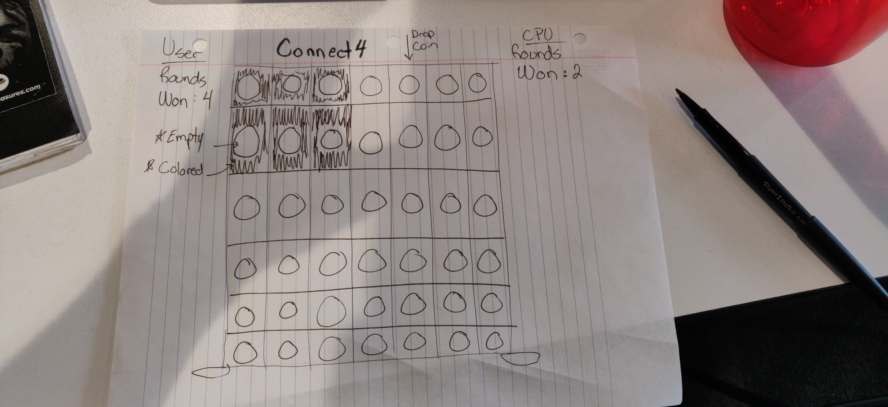

Connect 4- game README

----------------------------------------
MVP: 
THIS IS A TWO PLAYER GAME.
This game is played on a vertical board which includes seven columns and six rows.  There is a window frame to see each piece through, which includes 42 windows. 

 The player can stack coins on top of other coins, but the coins go down as far down on the board as possible, without overfilling a particular column. 

Both players have a set of 21 coins, each player uses a different color, and alternate taking turns. The board is empty at the start of the game and the first player will be randomly chosen.

Bonus:
-make it a 3 player game (3 colors, more rows.)

-Bonus animation whether to have the coins drop down into the slots.

